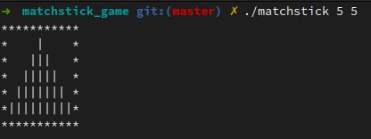
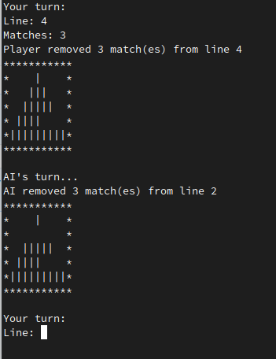
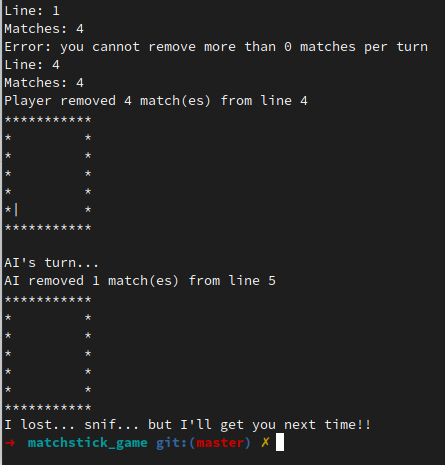

# Matchstick
## This project is based on a very famous game based on matchsticks.
There is a certain number of matchstick lines.
The two players take turns; each player can, on a same line, take one or several matchsticks.
The losing player is the one to take the last matchstick.

## The goal of the project is to create a program that you can play against.
The basic version must generate a game board with n matchstick lines (1 < n < 100) and have a simple interface so that the user could play against the computer.

### Start

--------------------------
### Game

--------------------------
### End

